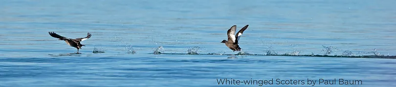
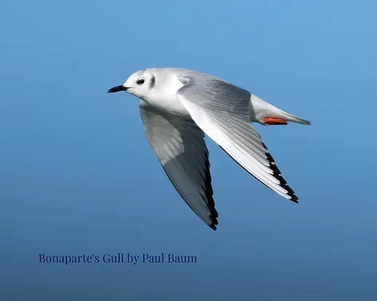
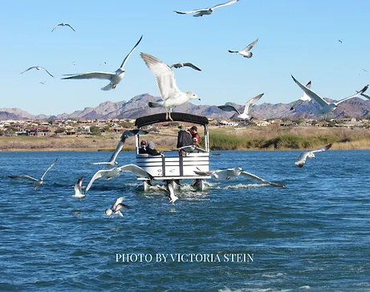
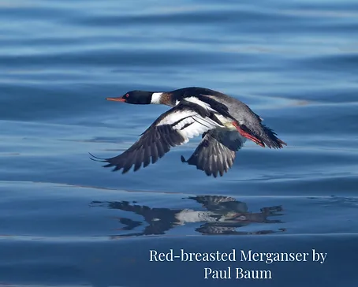

Participants raved about Our Winter Field Expedition, a boat trip on Lake Havasu! The trip was a half-day adventure on January 27, 2024, with two boats fully subscribed. The purpose of this survey was to collect data on birds wintering on the lake, to enhance data collected from on-shore reports.

Some expedition photos, below.

